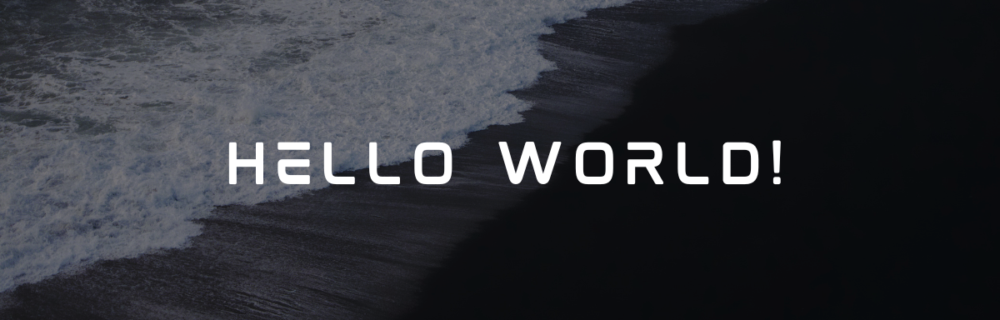

<!-- Google Font: Cormorant Garamond (elegant serif) -->

  

 

  

 

  &nbsp;
  &nbsp;
  &nbsp;
  

 

---

<h2 align="center"><em> ✦ About Me ✦ </em></h2>

<table border="0" style="border: none; border-collapse: collapse; background: transparent;" width="100%">
  <tr style="border: none; background: transparent;">
    <td width="68%" valign="middle" style="border: none; background: transparent; padding-right: 24px;">
      

        Hello! <em><b>I'm Pethuraja C</b></em> — a passionate <b>MERN Stack Developer</b> with <b>1+ year of professional experience</b> building responsive, scalable web apps using <b>React.js, Next.js</b> and <b>TypeScript</b>. Skilled across the full stack — REST APIs, JWT auth, WebSockets, Redux Toolkit.
      

       
      

        &nbsp;◈ &nbsp;<em><b>Frontend Developer — Alpharive Tech Pvt. Ltd. (2025 – 2026)</b></em> 
        &nbsp;◈ &nbsp;<em><b>B.C.A — Ayya Nadar Janaki Ammal College &nbsp;|&nbsp; CGPA: 6.8</b></em> 
        &nbsp;◈ &nbsp;<em><b>Built: Upzud · FinTrackz · CrownKey</b></em> 
        &nbsp;◈ &nbsp;<em><b>Exploring: Docker · System Design · Microservices</b></em>
      

    </td>
    <td width="32%" align="center" valign="middle" style="border: none; background: transparent;">
      <video src="./1.mp4" width="200" height="260" style="border-radius: 12px; object-fit: cover;" autoplay loop muted></video>
    </td>
  </tr>
</table>

 

---

<h2 align="center"><em> ✦ Technologies ✦ </em></h2>

  
  
  
  
  
  
   
  
  
  
  
   
  
  
  
  
  
  
   
  
  
  

 

---

<h2 align="center"><em> ✦ Statistics ✦ </em></h2>

  

 

  

 

---

  
    
  

 
